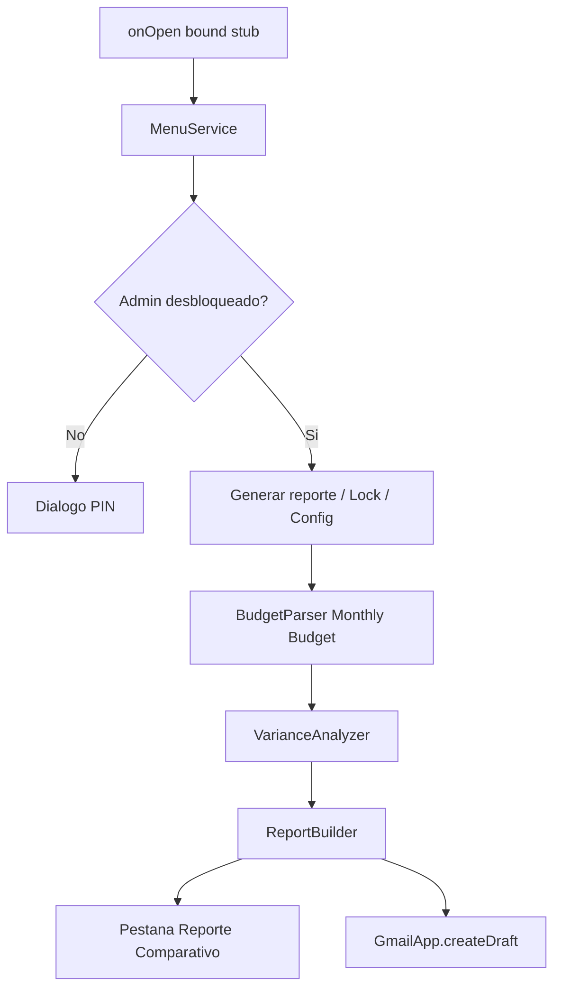

# Plan técnico: Prueba GrupoLyN (Sheets + Apps Script)

## Objetivo de entrega

Una carpeta en **tu Google Drive personal** (cuenta autenticada en esta máquina) y un **repositorio privado en tu GitHub personal**:

- Copia de la plantilla **versión 2.4** con menú **Admin** funcionando.
- Proyecto Apps Script (código fuente en GitHub + script bound / biblioteca).
- Documento breve de enfoque y supuestos (`README.md`).

Plantilla base (solo lectura): [DSM PROSPR Plan](https://docs.google.com/spreadsheets/d/1DmWspcWSL1YCqj2PlEOdrbKYMyvpieZKrKParZi1doM/edit?usp=sharing) (`1DmWspcWSL1YCqj2PlEOdrbKYMyvpieZKrKParZi1doM`).

Al implementar:

1. Crear carpeta Drive `GrupoLyN Technical Assessment v2.4` en **My Drive** (no Shared drives).
2. Copiar el spreadsheet original ahí (`File → Make a copy`). No editar el archivo compartido de GrupoLyN.
3. En Cover, cambiar `Version 2.3` → **`Version 2.4`**.
4. Instalar y autenticar `gh` con la cuenta personal ligada a `yohannylugo88@gmail.com`. Crear repo GitHub privado `grupolyn-plan-admin`; subir el código con `git push`. Para el evaluador: compartir la carpeta Drive y, si hace falta, invitar su GitHub al repo privado.

---

## Decisiones de arquitectura (recomendadas)

- **Código de negocio en una biblioteca standalone** (`GrupoLynFinanceLib`), no pegado solo al archivo. Así el bonus de despliegue masivo es coherente, no un añadido.
- **Stub mínimo bound** en cada hoja (solo `onOpen` + delegación a la librería). Facilita actualizar  N copias de clientes.
- **Reporte en dos canales** (la prueba permite uno u otro; ambos demuestran dominio):
  - Pestaña nueva `Admin Comparative Report` (no pisar las pestañas ya existentes `Jan/Feb/Apr/May/Jun Budget Comparison`).
  - Borrador Gmail opcional (`GmailApp.createDraft`) con el mismo texto.
- **Umbral de desviación: 15%** (el enunciado dice 15–20%). Configurable en `Config`.
- **Auth de Admin**: PIN por defecto **`GrupoLyn2026`**. En el primer `onOpen`, si `PropertiesService` no tiene PIN, se guarda ese valor. Sesión desbloqueada en `CacheService` del usuario (~30 min). El menú no muestra las herramientas hasta autenticarse. Tras desbloquear, la acción **Cambiar PIN** (prompt de PIN actual + PIN nuevo + confirmación) actualiza la propiedad; no reescribe el default en código.




---

## Fase 0 — Mapa real de la plantilla (cerrado)

El archivo es un plan **DSM PROSPR / Tiller-like** (pestañas `Transactions`, `AutoCat`, `Tiller.HiddenMetadata`, `Categories`, etc.). Cover hoy dice 2.3; **la copia de entrega se marca 2.4**.

Pestañas relevantes:

- `Monthly Budget`: fuente única del reporte (protegida / candado en la UI).
- `Categories`: catálogo `Category | Group | Type` (Income/Expense). Útil como fallback, no como fuente de importes.
- `Jan/Feb/Apr/May/Jun Budget Comparison`: ya hay reportes de comparación (probablemente de otro intento). **No sobrescribirlos.** Nuestra salida es otra pestaña + Gmail.

### Layout de `Monthly Budget`

Controles de periodo (usar el mes **Current**, no YTD):

- `F2` = Year (ej. 2025), `F3` = Month (ej. Jan)
- `J2` = View (`Current`)

Fila 5 (encabezados de mes):

- Columna **D** `Budget` = planificado
- Columna **F** `Actual`
- Columna **H** `Variance` (en esta hoja vale **Budget − Actual**: positivo = under, negativo = over)
- Columnas I–M = YTD (ignorar para el reporte pedido)
- Columna **P** `Hide` = fila oculta al cliente; el parser **omite** esas líneas como drivers

Jerarquía por columna (no por color):

- **A**: secciones (`Income`, `Expenses & Debt Service`, `Total Income`, `Total Expenses`, `Cash Flow Position`)
- **B**: categoría principal (`Shelter`, `Food & Supplies`, …) y fila `Total <categoría>`
- **C**: concepto de línea (`Mortgage`, `Landscaping`, `Grocery`, …)

Categorías de gasto a incluir (tras `Expenses & Debt Service`): Shelter, Food & Supplies, Medical, Education, Personal Care, Clothing, Transportation, Entertainment/Vacation, Holiday, Other Expenses, Capital Expenses, Savings, Debt Repayment.

**Fuera del reporte compacto de gastos:** bloques de Income (`Person 1`, `Person 2`, `Other Income`). Pueden ir en un resumen de una línea (Total Income Budget vs Actual) para el correo, no como categorías “over budget” al estilo Shelter/Food.

Datos actuales (Jan 2025) ya sirven de demo: Food & Supplies **+21.5%** (driver `Grocery` 3345 vs 2300), Other Expenses **+22.9%**, Education **+30%**, Medical **−63.6%**, Clothing **−75%**. No hace falta inventar Landscaping; el umbral 15% ya dispara varias categorías.

---

## Fase 1 — Estructura del proyecto (modular)

En este workspace, proyecto **clasp** (o carpeta `apps-script/`) con archivos separados:


| Archivo                                                    | Responsabilidad                                                                                           |
| ---------------------------------------------------------- | --------------------------------------------------------------------------------------------------------- |
| `[appsscript.json](apps-script/appsscript.json)`           | Manifest: scopes `spreadsheets`, `gmail.compose`, `script.container.ui`, Drive si el deployer lo necesita |
| `[Config.gs](apps-script/Config.gs)`                       | Nombres de hojas, umbral 0.15, `APP_VERSION = 2.4`, `DEFAULT_ADMIN_PIN = "GrupoLyn2026"` |
| `[AuthService.gs](apps-script/AuthService.gs)`             | PIN, unlock/lock, cache de sesión                                                                         |
| `[MenuService.gs](apps-script/MenuService.gs)`             | Construcción del menú Admin                                                                               |
| `[BudgetParser.gs](apps-script/BudgetParser.gs)`           | Lectura de `Monthly Budget` → modelo `{ category, items[], planned, actual }`                             |
| `[VarianceAnalyzer.gs](apps-script/VarianceAnalyzer.gs)`   | `%` de desviación, drivers de la categoría                                                                |
| `[ReportBuilder.gs](apps-script/ReportBuilder.gs)`         | Texto + formato de pestaña                                                                                |
| `[GmailDraftService.gs](apps-script/GmailDraftService.gs)` | Borrador de correo                                                                                        |
| `[Code.gs](apps-script/Code.gs)`                           | Punto de entrada público de la librería (`onOpen`, `unlockAdmin`, `generateMonthlyComparativeReport`)     |
| `[deploy/MassDeploy.gs](apps-script/deploy/MassDeploy.gs)` | Bonus: vincular librería a lista de URLs                                                                  |
| `[README.md](README.md)`                                   | Enfoque, supuestos, cómo probar                                                                           |


Principio: **cero lógica de negocio en el stub bound**. El bound solo hace:

```javascript
function onOpen() {
  GrupoLynFinanceLib.onOpen();
}
```

---

## Fase 2 — Menú Admin y control de acceso

Comportamiento:

1. Al abrir el libro, `onOpen` crea el menú **Admin**.
2. Si no hay sesión válida:
  - `Desbloquear…` → `ui.prompt` (o `HtmlService` si se quiere PIN enmascarado).
  - PIN incorrecto: aviso y menú sin herramientas.
3. Si el PIN es correcto:
  - Marcar sesión en `CacheService.getUserCache()`.
  - Reconstruir menú con:
    - Generar reporte comparativo mensual
    - Enviar/crear borrador Gmail
    - Bloquear Admin
    - Cambiar PIN de administrador (obligatorio en el menú, no opcional)
4. Primer uso: si no hay PIN en `PropertiesService`, persistir **`GrupoLyn2026`**. El administrador puede cambiarlo después; el nuevo valor vive solo en propiedades del script. Documentar el default en el README.

Límite a dejar explícito en el documento de supuestos: **esto no es seguridad corporativa**. Cualquiera con acceso de edición al script puede leer propiedades. El PIN evita uso accidental por el cliente, no un ataque. Eso se valora en una prueba de consultoría.

---

## Fase 3 — Parser de Monthly Budget (reglas concretas)

```javascript
{
  year: 2025,
  month: "Jan",
  categories: [{
    name: "Shelter",
    planned: 4009.94,   // de fila "Total Shelter" col D
    actual: 3949.97,    // col F
    items: [{ name: "Mortgage", planned: 3567.29, actual: 3567.29, hidden: false }]
  }]
}
```

Algoritmo:

1. Abrir hoja `Monthly Budget`; leer `F2`/`F3`.
2. Recorrer filas desde la 7.
3. Si col B es cabecera de grupo (no empieza por `Total` ) y col C vacía → categoría activa.
4. Si col C tiene nombre → ítem de esa categoría (D/F numéricos; `P === Hide` → no usar como driver).
5. Si col B es `Total <nombre>` → asignar planned/actual oficiales del grupo (no re-sumar, las fórmulas de la plantilla mandan).
6. Parar o ignorar cuando col A sea `Cash Flow Position`.
7. Solo lectura: no escribir en `Monthly Budget`.

Si falta la fila Total, fallback: suma de ítems no hidden.

---

## Fase 4 — Análisis de desviación

Para cada categoría:

- `variance = actual - planned`
- `pct = planned === 0 ? (actual !== 0 ? Infinity : 0) : variance / planned`
- **Significativa** si `abs(pct) >= 0.15`.
- Over budget = `actual > planned`; under budget = `actual < planned`. No reutilizar el signo de la col H de la plantilla en el texto (allí el signo está invertido).

Si es significativa:

- Ordenar ítems por `|actual - planned|` descendente.
- Tomar los que expliquen la mayor parte de la desviación (p. ej. los que superen 50% de la brecha de la categoría, o top 3).
- Texto al estilo del enunciado:

```
Shelter is over budget by 20%.
- Landscaping: $2,000 (Actual) vs $1,000 (Planned)
```

Categorías dentro de umbral: una línea compacta `Food: $X actual vs $Y planned` sin detalle, para que el reporte siga siendo compacto.

---

## Fase 5 — Salida del reporte

**Pestaña `Admin Comparative Report`:**

- Recrear o limpiar la hoja en cada generación (periodo `Jan 2025` + timestamp).
- Bloque de resumen (totales globales).
- Por categoría: totales; si hay alerta, filas extra con explicación + ítems drivers.
- Formato: negrita en categorías, rojo/naranja en over budget, verde en under (opcional, discreto).
- No usar un dump crudo de toda la pestaña origen.

**Gmail:**

- `GmailApp.createDraft(to, subject, body)` con `to` vacío o un placeholder; subject tipo `Monthly comparative report — [mes]`.
- Mismo cuerpo en texto plano (el ejemplo del enunciado).
- Opción de menú separada para no mandar correo real.

---

## Fase 6 — Bonus: despliegue masivo

Enfoque realista en dos capas (esto es lo que un arquitecto senior mostraría):

**Capa A — Operación estándar (siempre entregar)**  
Documento + script de “bootstrap” de 10 líneas que cada hoja debe tener, más el **Library ID** de `GrupoLynFinanceLib`. Actualizar la librería = todas las copias reciben la función nueva en el siguiente `onOpen` (si usan versión fija, hay que avanzar versión; documentar “head” vs versión numerada).

**Capa B — Automatización (el script pedido)**  
`[MassDeploy.gs](apps-script/deploy/MassDeploy.gs)` pensado para correr desde un libro de operaciones `Deploy Console`:

- Columna de URLs de Sheets de clientes.
- Para cada URL:
  1. Extraer spreadsheet ID.
  2. Vía **Apps Script API** (`scripts.googleapis.com`): obtener el `scriptId` del contenedor, actualizar `appsscript.json` / `source` para **añadir la librería** (`userSymbol: GrupoLynFinanceLib`, `libraryId`, `version` o development mode).
  3. Inyectar/mergear el stub `onOpen` si no existe (no pisar otros `onOpen`: componer llamando también a la librería).
- Registrar OK / error por fila (permisos, API no habilitada, hoja sin contenedor de script).

Supuestos del bonus (dejarlos por escrito):

- Google Workspace / proyecto GCP con Apps Script API habilitada.
- La cuenta que ejecuta el deployer tiene acceso de edición a cada copia.
- No se puede “vincular biblioteca” solo con `SpreadsheetApp`; hace falta Script API o un paso manual. El código lo deja claro.

---

## Fase 7 — Pruebas manuales (criterio de aceptación)

Sobre la copia, con los datos reales de Jan 2025 (Food & Supplies / Grocery ya superan 15%):

1. Menú Admin aparece al recargar.
2. Sin PIN no hay “Generar reporte”.
3. PIN incorrecto no desbloquea.
4. PIN correcto (`GrupoLyn2026` de fábrica) revela acciones; recargar la hoja mantiene sesión ~30 min. Cambiar PIN y volver a desbloquear con el nuevo.
5. El reporte lista categorías de `Monthly Budget` con solo totales salvo desviación ≥ 15%.
6. Una categoría forzada al 20% muestra explicación + línea(s) driver.
7. Se crea pestaña y, en la otra acción, un draft en Gmail.
8. El código bound es mínimo; la librería contiene la lógica.

No hay servidor web de la app en este workspace: la verificación será en Google Sheets / Gmail, no en el navegador local.

---

## Fase 8 — Empaquetado de entrega

**Drive personal** (`My Drive`), carpeta `GrupoLyN Technical Assessment v2.4`:

1. Spreadsheet v2.4 (Cover actualizado) + Apps Script bound.
2. Copia del README / notas de enfoque.
3. Compartir la carpeta con el evaluador (enlace o invitación).

**GitHub personal (privado):**

1. `gh auth status` para confirmar tu usuario.
2. `gh repo create` privado, origin en esa cuenta (no org de Cursor).
3. Push de `apps-script/`, README y `docs/`.
4. En el README de Drive, pegar la URL del repo e indicar que es **privado** y hay que invitar al revisor.

En el README: versión **2.4**, PIN default `GrupoLyn2026`, umbral 15%, límites de seguridad, deployer, mapa de `Monthly Budget`. Tono: problema → diseño (librería + stub) → por qué (N clientes) → supuestos.

---

## Orden de implementación (cuando salgamos de plan)

1. Crear carpeta en Drive personal, copiar plantilla, Cover → Version 2.4.
2. Scaffold clasp + `appsscript.json`.
3. Auth (PIN `GrupoLyn2026` + cambiar PIN) + menú.
4. Parser + analyzer + reporte en pestaña.
5. Draft Gmail.
6. Publicar como biblioteca y reducir el bound a stub.
7. Script de mass deploy + notas.
8. README, push a GitHub personal privado, compartir carpeta Drive.

Al implementar, borrar el dump local `.tmp-grupolyn.xlsx` si sigue en el workspace (no forma parte de la entrega).